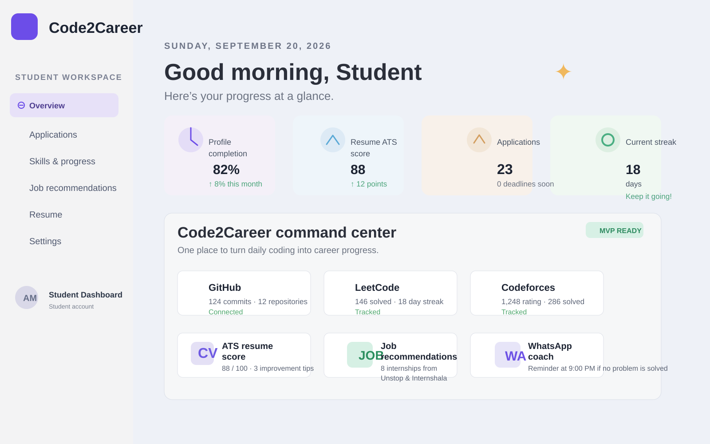

# Code2Career

A student-focused career growth dashboard that helps learners track coding progress, view resume readiness, monitor applications, and receive reminders for career milestones.

## Screenshot



## Overview

Code2Career combines coding activity, job preparation, and personal progress tracking into a single dashboard. Students can:

- monitor GitHub, LeetCode, and Codeforces activity
- review resume ATS score and career readiness
- track applications and deadlines
- save skills and goals
- receive reminders and career automation nudges
- upload PDF resumes for review

This project is built as a Java Spring Boot backend with a lightweight frontend interface and AWS-ready integrations for email and file storage.

## Tech Stack

- Backend: Java 21, Spring Boot 3.3.x, Spring Security, Spring Data JPA
- Frontend: HTML, CSS, JavaScript
- Database: PostgreSQL-ready, with local H2 support for development
- AWS: SES for email notifications, S3 for file uploads, EC2 deployment support
- Build: Maven

## Project Structure

- backend/: Java backend and Spring Boot app
- frontend/: browser UI and local proxy server
- deploy/: EC2 deployment script
- README.md: project overview and setup guide

## Features

- secure authentication and JWT-based user sessions
- student dashboard overview
- coding profile sync placeholders for GitHub, LeetCode, and Codeforces
- resume upload and ATS-style review flow
- job recommendation and application tracking
- WhatsApp reminder configuration support
- AWS SES and S3 integration hooks for production

## Local Setup

### Backend

```bash
cd backend
mvn clean package -DskipTests
mvn spring-boot:run
```

The app starts on port 8080 by default.

### Frontend

```bash
cd frontend
node server.js
```

The frontend runs on:

- http://localhost:5173

## Environment Variables

Copy the example environment file and configure your values:

```bash
cd backend
copy .env.example .env
```

Example values include:

- DB_URL
- DB_USERNAME
- DB_PASSWORD
- JWT_SECRET
- AWS_REGION
- AWS_SES_FROM_EMAIL
- AWS_S3_BUCKET

## AWS Usage

This project includes AWS-ready integrations for:

- Amazon SES for email notifications
- Amazon S3 for storing uploaded resumes/files
- Amazon EC2 deployment scripts for hosting the backend

## Deployment

A deployment script is included for EC2-based hosting:

- deploy/ec2-deploy.sh

For production, configure the environment variables and deploy the packaged JAR to an EC2 instance.

## Notes

- The repo is intentionally kept free of hardcoded production API secrets.
- Frontend API base values are environment-driven and hidden from public runtime configuration.
- The local backend uses H2 by default for development, and can be switched to PostgreSQL in production.

## License

This project is provided for educational and portfolio use.
